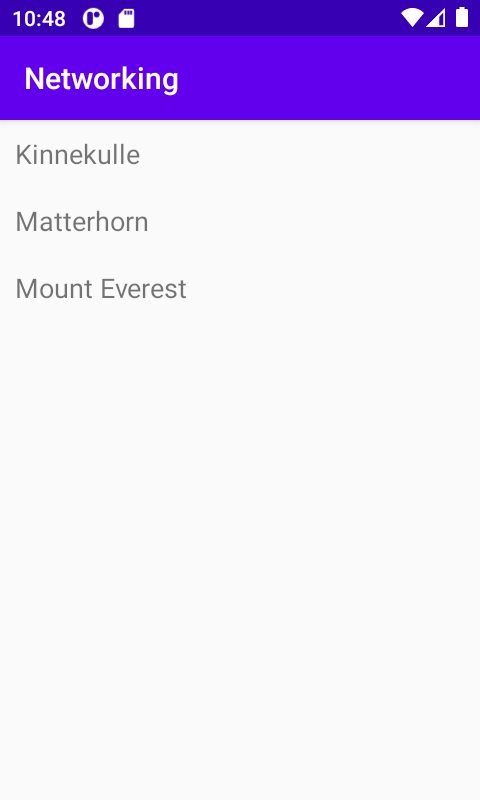

# Rapport
började med att lägga en Recyclerview på min Activity_Main xml fil och därefter skapade jag en till xml fil som heter item_mountain.
nästa steg så hämtades alla variabler till mainactivity och därefter skapade jag en Item class med getters och setters som håller koll på id name, cost och size.
skapade också en ViewHolder class där jag hämtade id för textview som låg i item_mountain xml. därefter skapade jag en adapter class som heter MyAdapter där holders för varje variabel laddes till.

        adapter = new MyAdapter(this, mountains, new MyAdapter.OnClickListener() {
                @Override
                public void onClick(RecyclerViewItem item) {
                    Toast.makeText(MainActivity.this, item.getTitle(), Toast.LENGTH_SHORT).show();
                }
            });
koden deklarerar och initierar en adapter och lägger till en onClick när man clickar på texten.

        RecyclerView view = findViewById(R.id.recycler_view);
den här koden länkar view med recyclerview
view.setLayoutManager(new LinearLayoutManager(this));
view.setAdapter(adapter);
första rad koden ger en linear layout alltså uppifrån texten kommer synas uppifrån ner. 
andra rad koden berättar vilken adapter som ska användas.

        new JsonFile(this, this).execute(JSON_FILE);
koden läser Json filen.
    
    Gson gson = new Gson();
     Type type = new TypeToken <ArrayList<Item>>(){}.getType();
        List<Item> listOfItems = gson.fromJson(json, type);
koden konverterar json filen så att den kan användas i recyclerview.

      for (Item item : listOfItems){
            mountains.add(new RecyclerViewItem(item.getTitle()));
        }
koden skapar en forloop och lägger till mountains till recyclerview.

